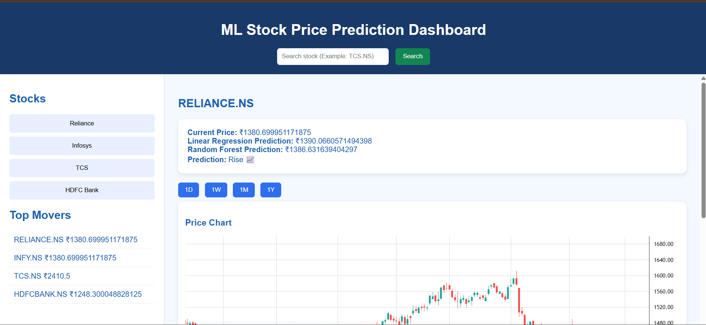
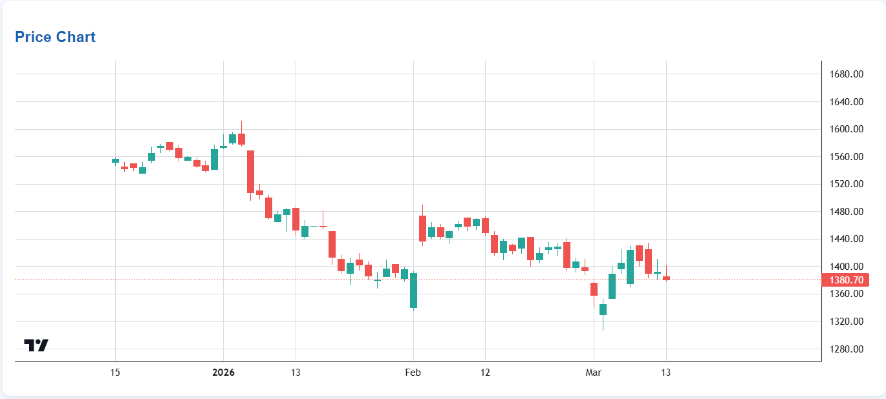

# BullTrade
BullTrade is a stock market trend prediction system built using machine learning techniques. It processes historical stock price data, performs feature extraction, and applies Machine Learning algorithms to analyze market behavior and forecast future trends.
# 📈 BullTrade — ML Stock Price Prediction Dashboard

BullTrade is a web-based stock analytics dashboard that predicts stock prices using Machine Learning models and visualizes stock market data with interactive charts.

---

## 🚀 Features

- 📊 Candlestick price charts
- 📉 Volume bars
- 🤖 Machine Learning predictions
- 🔍 Search any stock symbol
- 📈 Linear Regression & Random Forest models
- 📊 Market movers dashboard
- 🟩 NIFTY heatmap visualization
- ⚡ Real-time stock data from Yahoo Finance

---

## 🧠 Machine Learning Models

The project uses two models:

| Model | Purpose |
|------|--------|
| Linear Regression | Predict future price trend |
| Random Forest | Capture non-linear patterns |

Features used:

- Previous Close Price
- Moving Average (10 days)
- Moving Average (50 days)
- Trading Volume

---

## 🏗️ Architecture

---

## 📷 Screenshots

### Dashboard

### Stock Chart

---

## 🛠️ Tech Stack

Frontend
- HTML
- CSS
- JavaScript
- TradingView Lightweight Charts

Backend
- Python
- Flask
- Pandas
- Scikit-learn

Data
- Yahoo Finance API

---

## ⚙️ Installation

Clone the repository
